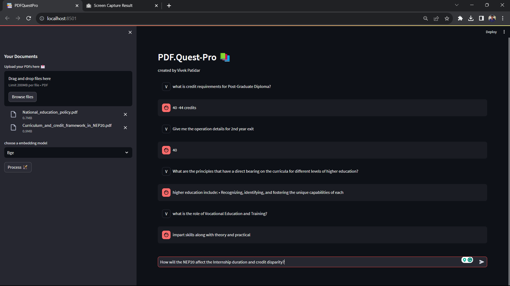
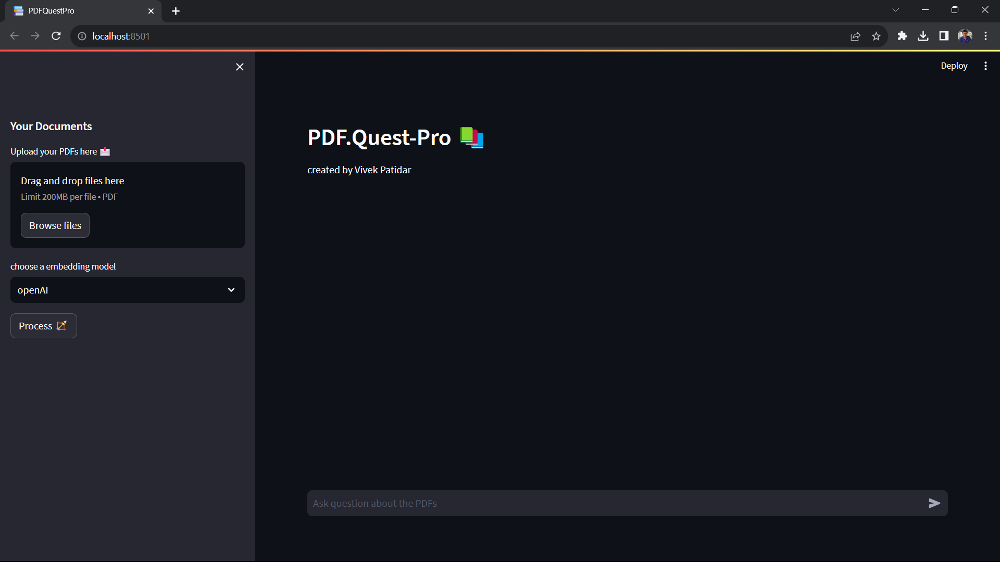
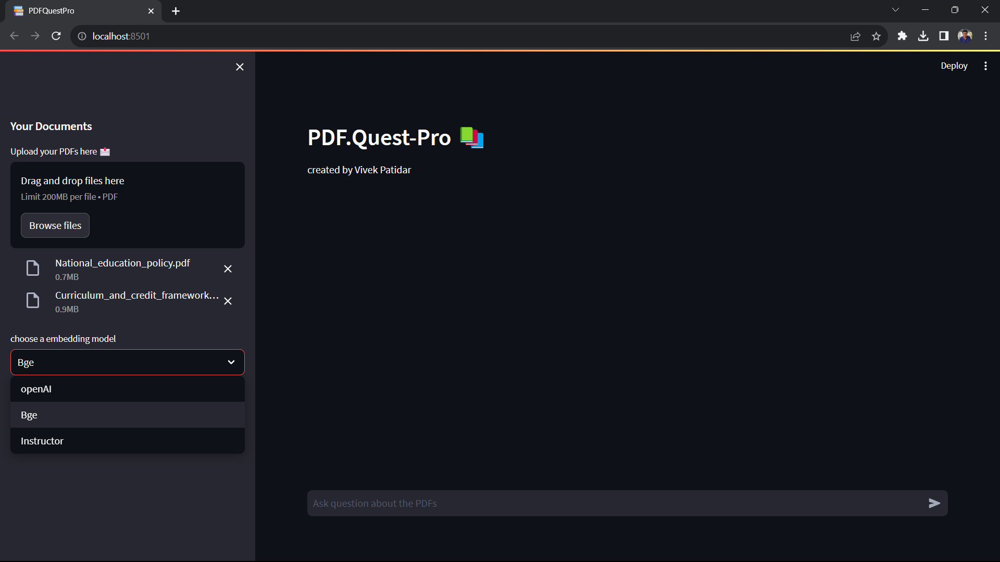
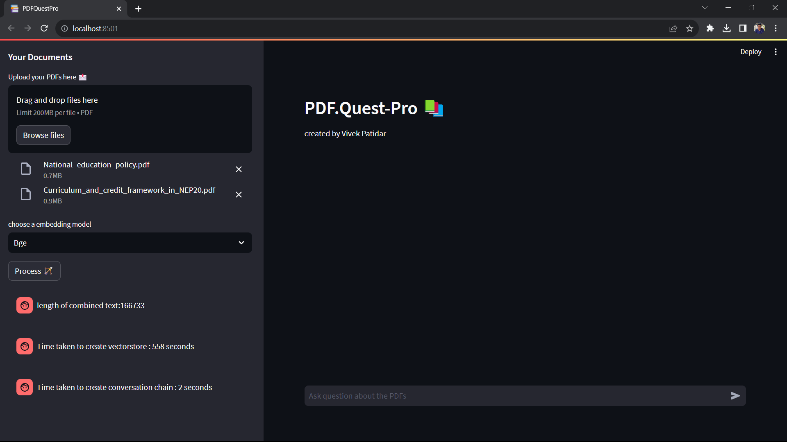

# PDF.quest-pro
Multi PDF Interactive Query Application

## Overview
------------
The PDF.quest-pro Chat App is a Python application that allows you to chat with multiple PDF documents. 
You can ask questions about the PDFs and the bot will give you answers from the PDFs. 
This app will only answer to questions related to the loaded PDFs only else it will tell you that "I don't know".

## WorkFlow
------------



1. PDF Loading: Extract the text from all the uploaded PDFs. {using PyPDF2}
2. Text Chunking: The extracted text is divided into smaller chunks for further processing. {using CharacterTextSplitter from langchain}
3. Language Model: The application utilizes a language model to generate vector representations of the text chunks. {using OpenAIEmbeddings and HuggingFaceInstructEmbeddings}
4. Similarity Matching: When you ask a question, the app compares it with the text chunks and identifies the most semantically similar ones. {using FAISS}
5. Response Generation: The selected chunks are passed to the language model, which generates a response based on the relevant content of the PDFs.{using langchain, flang-t5 model(best performance)}

## Requirements
----------------------------
Install the required dependencies by running the following command:
   ```
   pip install -r requirements.txt
   ```
Add your API key in the .env file in the already-created variables

## To Run the App 
Execute the following command in virtual env:
   ```
   streamlit run app.py
   ```

A very interactive user interface app will appear



Select the embedding model you want to use


Load All the PDFs you wants to chat with


Chat with the ChatBot and wait for the response


